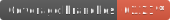
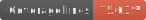
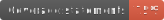
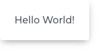

# Rasa-UI for React


[](https://www.npmjs.com/package/@headstorm/hs-react-ui) 


[](./coverage)
[](./coverage)
[](./coverage)
[](./coverage)


Rasa UI is lovingly developed by Headstorm's Open Source group. Please reach out to us at: opensource@headstorm.com


### 🔥 [Live Demo](https://headstorm.github.io/rasa-ui/)

##Getting Started

###Requirements

 - Node >= 10.18
 
Peer dependencies:

 - react ^16.13.1 
 - react-dom ^16.13.1
 - react-is ^16.13.1
 - react-spring ^8.0.27
 - styled-components >= 5.1.0

If you're new to React or web development, no problem! There are other great open-source tools out there that will have you creating gleaming web apps in a reasonably short amount of time. If you haven't already, set up a new React project--a great place to start is [create-react-app](https://create-react-app.dev/docs/getting-started). 

###Install Rasa-UI into a React app

Rasa for React is available as a scoped public Node package. You can use [npm](https://docs.npmjs.com/) or [yarn](https://classic.yarnpkg.com/en/docs) to add the Foundry package to your project. From you project's root directory, where the `package.json` file is located, run the command:

```
npm install @headstorm/hs-react-ui
// or
yarn add @headstorm/hs-react-ui
```

For the peer dependency [styled components](https://styled-components.com/) install from the same root directory, run the command:

```
npm install --save styled-components
// or
yarn add styled-components
```


##Usage

###Hello World
Get started with a simple hello world

```
import { Card } from '@headstorm/hs-react-ui'; 

function HelloWorld() {
    return <Card>Hello World!</Card>;
export default HelloWorld;
```
Output:



In this hello world example, you can see the Card component has preset styling for the Container and Body components that come right out of the box. Rasa components are wrapped in a container element. See the `CardContainer` and `Body` base configurations below. It is recommened to check out the component's declaration source to see what styles are included.

```
// /hs-react-ui/src/components/Card/Card.tsx

export const CardContainer = styled(Div)`
  ${({ elevation }: { elevation: number }) => {
    const { grayXlight, background, shadow } = useColors();
    return `
      display: inline-flex;
      flex-flow: column nowrap;
      font-size: 1rem;
      border-radius: 0.25rem;
      border: ${!elevation ? `1px solid ${grayXlight}` : '0px solid transparent'};
      transition: box-shadow ${timings.slow}, filter ${timings.slow}, border ${timings.slow};
      ${getShadowStyle(elevation, shadow)}
      background-color: ${background};
  `;
  }}
`;

...

export const Body = styled(Div)`
  ${() => {
    const { grayMedium } = useColors();
    return `
      padding: 1.5rem 1.5rem;
      color: ${grayMedium};
    `;
  }}
`;
```

###Override styles

```
import React from 'react';
import { Card, colors } from '@headstorm/hs-react-ui'; 
import styled from 'styled-components';

// Foundry provides a basic set of colors, but feel free to add your own
const myColors = {
  ...colors,
  blue: 'blue',
  };

// We recommend starting with the Foundry provided styling, in this case 'Card.Container', 
// and then add you own overrides or new styles. 
// If you were to set ThemedContainer = styled.div, you would lose all the Foundry preset styling.

const ThemedContainer = styled(Card.Container)`
  border: 0 solid ${myColors.blue};
  border-width: 0 0 1rem 0;
  border-radius: 1rem;
  overflow: hidden;
  margin: 2rem;
`;

const StyledHeader = styled(Card.Header)`
  background-color: ${myColors.blue};
  color: white;
  font-size: 5rem;
  padding: 1rem;
`;

const ThemedBody = styled(Card.Body)`
  color: ${myColors.grayMedium};
  font-family: Comic Sans MS, cursive, sans-serif;
  font-size: 4rem;
  font-weight: bold;
  padding: 2rem 1rem;
  text-align: center;
`;

const StyledFooter = styled(Card.Footer)`
  background-color: ${myColors.blue};
  padding: 1rem;
  min-height: 1rem;
`;

function HelloWorld() {
    return (
      <Card
        StyledContainer={ThemedContainer} // Set your overrides for each element
        StyledHeader={StyledHeader}
        StyledBody={ThemedBody}
        StyledFooter={StyledFooter}
        header={'HELLO'} // Add your content
      >
        World
    </Card>);
};
export default HelloWorld;
```
Output:


###Composing components

See the [Form demo example] (https://headstorm.github.io/rasa-ui/?path=/story/form-example--controlled-form) and [source code](./src/components/Examples/Form.stories.tsx)

###Global styling

See the [Global source code](./src/components/Examples/GlobalStyles.stories.tsx)

# Contributing

Pick a ticket from the `Priority to do` swim-lane of the [project board](https://github.com/Headstorm/rasa-ui/projects/1). **Fork and clone** the repository and create a branch for your ticket, with the ticket number prefixing the name of the ticket (i.e. `4-publish-package-to-npm`). When making commits, be sure to prefix your commit messages with the ticket number, like so: `#4 Updating package.json to make the package public`. Once you've made a commit it should automatically be moved to the `In progress` swim-lane, and then moved to `Needs review` once a PR is made. For commits to be included in the changelog you muse use formatted commit messages. We've made this easier to do by adding a script for committing messages, simply use `npm run commit` or `yarn commit` to create your commits that should be added to the changelog.

## Locally

Run `yarn install` to install the dependencies, then you can run `yarn start` to start the storybook server.
The app will automatically reload if you change any of the source files.

## Running unit tests

Run `yarn test` to execute the unit tests via Jest.

# Theming components

HS-UI is themeable on many levels and allows you to customize as little or as much as you want. Gone are the days of having to use deep CSS selectors with `!important` on every style.

## Basics

Each base component is built from at least one styled-component. When theming each component, it is highly recommended that you open the source for the base component so that you know all of the styles currently applied.

For example, the Card component has 4 (at the time of writing) styled-components which make up the entire component. It has a container, header, body, and footer. There are many levels of customization you can apply to the Card:

- Color scheme, animation timings, and other constants
  - Completely replace the `colors` and `timings` constants objects, so that existing styled-components will use your theme without any other intervention.
  - Import the built-in constants, spread them at the top of your new constants object, and then override only the constants you want to change.
  - NOTE: This feature has not yet been completed, see [Issue #15](https://github.com/Headstorm/rasa-ui/issues/15) to follow the progress.
- Replace a portion of a base component with your own styled-component
  - While the `Card` `Header` is a `styled.div` with `text-transform: uppercase`, you can pass in any styled component to replace the header entirely, it could even be a `styled.span` if you want! Create your styled-component and then pass it to the StyledHeader prop of the `Card` and voilà! It doesn't use any of the previous styles that were originally created for the Card Header.
  - You'll have access to all the props which are passed to the styled-component as well. In the case of Card, the `elevation` prop is passed directly into the Container, so while a Material Design theme may use it to programatically control the `box-shadow` and `border` property, you can use it for anything you wish.
- Add CSS/SASS overrides to a portion of a base component
  - This almost the same as the previous method, except that you'll first import the piece you're overriding from the original base component. In the case of the Card Header, you'll `import Card, { Header } from 'hs-react-ui/Card;`, and then use that as your base as so: `` styled(Header)`styles go here` ``. You'll have the full power of styled-components, and you can include your constants files as you like.
  - Again, the `styled(Header)` will receive the same props that the original did, giving you full control of how to handle the props in the style.

## Notes on architecture

We use custom HTML elements in place of the built in styled-components elements.
These elements have a set of sensible default styles that we wish to apply to all elements. This means:

```jsx
// don't do this
import styled from 'styled-components';
const MyContainer = styled.div`styles`;

// do this
import styled from 'styled-components';
import { Div } from 'path/to/htmlElements';
const MyContainer = styled(Div)`styles here`;
```

## Creating new components

### Enabling Theming

Theming is enabled through props of each component. When building a new component, or adding a styled-component to an existing component, ensure that there is a matching prop to accept an override, and that styled-component is a named export from the component. See the [Card component](https://github.com/Headstorm/rasa-ui/tree/master/packages/hs-react-ui/src/components/Card) as an example.

## State of CICD workflow
###What's working?
- Pushes to master trigger a release build
- Auto versioning
- Pushes to v1-release trigger a pre-release build
build checks on every PR to master and v1-release
- Change logs are generated (see link below)
- storybook docs are generated and checked in for releases
- Test coverage

###What isn't working yet?
- Publishing to NPM isn't working yet due to the authentication token not having proper permissions - we have a ticket submitted to get this fixed and Bennett has been doing an excellent job tackling those types of tickets for us :clapping:
- Releases like 1.0.0-alpha.# - we need to configure a new alpha branch to get releases like that. Currently we have them attempted to be created in this format: #.#.#-v1-release.#

###How am I impacted as a developer?
- Husky has been added for pre-commit and pre-push hooks. Please pull the latest and install dependencies in /rasa-ui to get the hooks working. (the root install will also update dependencies, but using npm instead of yarn - we can fix this in the future for consistency)
- Commits that we want added to the Change log must use commitizen, when working inside of hs-react-ui using yarn commit will use commitizen. Alternatively you can use npx git-cz
- Commits to be excluded from the change log (eg. "Fix typo that broke my pre commit linting") can continue to use normal git commits
- Package.json is no longer the source of the version published, semantic-release uses git tags to determine the release version - this is only the case in our workflows. If we do a manual push we must update package.json before publishing
- Auto versioning - No more package.json version bumps required :tada:
(edited)

## Known Issues
Using with server-side rendering (SSR) apps, i.e. apps created with NextJS, don't have a window object and will require polyfilling.

## [ChangeLog](./CHANGELOG.md)